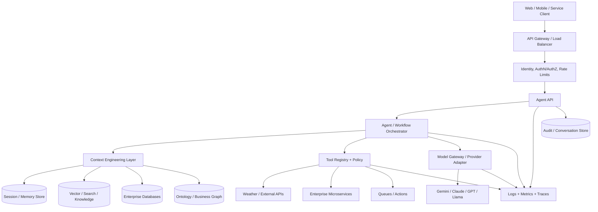
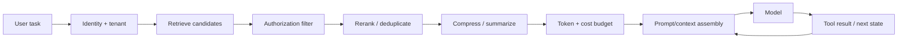

# Taking Agentic AI and LLM-Based Systems Into Production

A practical, architecture-first reference for moving an agentic AI or LLM application from a single Python script into a secure, observable, testable, scalable production system.

The repository uses a small weather agent as the running example because the business logic is intentionally easy to understand. The production patterns are the point: API boundaries, tool governance, context engineering, identity, state, resilience, observability, testing, deployment, cost control, and operational ownership.

> **Core idea:** a production agent is not just an LLM call. It is a distributed software system in which the model is one component.

## 1. Starting point: a useful prototype

A prototype can be only a few lines:

```python
from google import genai
from google.genai import types

client = genai.Client()

def get_current_weather(location: str) -> str:
    """Get the current weather for a given location."""
    if "tokyo" in location.lower():
        return "15 degrees Celsius and rainy."
    return "22 degrees Celsius and partly cloudy."

config = types.GenerateContentConfig(
    tools=[get_current_weather],
    temperature=0.0,
)

response = client.models.generate_content(
    model="gemini-2.5-flash",
    contents="What is the weather like in Tokyo right now? Should I bring an umbrella?",
    config=config,
)
print(response.text)
```

This proves that the model can decide to use a tool and synthesize the result. It does **not** yet answer the production questions:

- Who is allowed to call the agent?
- Which tools may that identity use?
- What data is the model allowed to see?
- What happens when the model provider or tool API times out?
- How are retries bounded so an outage does not amplify traffic?
- How is conversation state stored across replicas?
- How are prompts, models, tools, and policies versioned?
- How do we observe latency, error rate, token usage, tool failures, and cost?
- How do we test a nondeterministic system before deployment?
- How do we roll back safely?
- How do we prove what happened after an incident or regulated decision?

Production engineering is the work of answering those questions systematically.

---

## 2. Production target architecture



The application should be decomposed into responsibilities rather than allowing the model call to own everything.

| Layer | Responsibility |
|---|---|
| Edge / Gateway | TLS, routing, coarse rate limits, WAF, request size limits |
| Identity | Authentication, authorization, tenant/user identity |
| Agent API | Stable application contract, validation, correlation IDs |
| Orchestration | Agent loop, workflow state, retries, budgets, fallbacks |
| Context Engineering | Select the right instructions, data, memory, evidence and tool state |
| Tool Layer | Typed tools, allowlists, validation, timeouts, idempotency, permissions |
| Model Gateway | Provider/model abstraction, routing, quotas, token accounting |
| State | Sessions, checkpoints, conversation state, caches |
| Knowledge | RAG, structured retrieval, graph/ontology retrieval |
| Observability | Logs, metrics, traces, model/tool telemetry |
| Governance | Prompt/model/tool versions, policy, evaluation, auditability |

---

## 3. What changes from prototype to production?

### 3.1 Put a stable API boundary in front of the agent

The prototype runs once and exits. A production service accepts concurrent requests and exposes a contract that clients can depend on.

This repository uses **FastAPI** to provide:

- request/response schemas;
- `/v1/agent/query`;
- `/health/live` and `/health/ready`;
- correlation IDs;
- centralized error handling;
- a natural place for authentication, authorization and rate limiting.

See [`src/agentic_production/api.py`](src/agentic_production/api.py).

### 3.2 Separate orchestration from tools

Tools are application capabilities, not arbitrary Python functions the model should be free to execute without policy.

A production tool should have:

1. a typed contract;
2. input validation;
3. identity/permission checks;
4. timeout and retry policy;
5. idempotency strategy for writes;
6. structured errors;
7. telemetry;
8. an owner and version.

The demo registry is intentionally small, but the architecture scales to CRM, payments, inventory, ticketing, search, databases and internal microservices.

### 3.3 Engineer context, not just prompts

**Prompt engineering asks:** *How should the model be instructed?*

**Context engineering asks:** *What should the model know and be allowed to use for this task, for this identity, at this step?*

A production context may contain:

```text
system policy
+ user identity / tenant
+ authorization scope
+ current goal
+ selected conversation history
+ retrieved documents
+ structured database facts
+ ontology / entity relationships
+ agent state
+ available tool definitions
+ previous tool results
+ safety constraints
+ token budget
```

Do not dump every available document or chat message into the context window. Retrieve, filter, rerank, deduplicate, compress and budget context deliberately. See [`docs/CONTEXT_ENGINEERING.md`](docs/CONTEXT_ENGINEERING.md).

### 3.4 Make state external to the process

A single process can keep a Python dictionary. Replicated services cannot depend on that dictionary.

Use external systems for:

- **Redis**: short-lived session state, distributed rate-limit counters, caches, locks;
- **PostgreSQL**: conversations, audit events, durable workflow metadata;
- **Object storage**: large artifacts/documents;
- **Vector/search store**: semantic retrieval;
- **graph/ontology store** where relationships materially improve retrieval or decisions.

The included implementations are deliberately lightweight reference adapters rather than an attempt to prescribe one vendor.

### 3.5 Bound every network dependency

Every remote dependency eventually becomes slow or unavailable. Production calls should have explicit:

- connect/read timeouts;
- bounded retries;
- exponential backoff + jitter;
- circuit breakers where appropriate;
- concurrency limits;
- fallback behavior;
- cancellation propagation.

**Retry only operations that are safe to retry.** For tools that cause writes, use idempotency keys or an application workflow that prevents duplicate side effects.

### 3.6 Treat security as part of agent architecture

An LLM does not become an authorization system just because it can reason about text.

Enforce permissions in deterministic code before data is added to context or a tool is executed.

Key controls:

- AuthN at the edge/API;
- RBAC/ABAC and tenant isolation;
- secrets in a secrets manager, never Git;
- prompt-injection-aware tool policy;
- egress restrictions for tool services;
- input/output validation;
- PII/regulated-data handling;
- audit trail of important model/tool decisions;
- human approval for consequential actions.

See [`docs/SECURITY.md`](docs/SECURITY.md).

### 3.7 Observe the whole chain, not only the HTTP endpoint

A 12-second request tells little by itself. Trace the chain:

```text
request -> context retrieval -> model -> tool -> model -> persistence -> response
```

Track at minimum:

**Service metrics**
- request rate;
- p50/p95/p99 latency;
- 4xx/5xx/error rates;
- saturation, queues and dependency health.

**LLM metrics**
- time to first token (TTFT) when streaming;
- inter-token latency (ITL);
- input/output tokens;
- tokens/sec;
- requests/sec;
- model/provider errors;
- retry count;
- estimated cost.

**Agent/tool metrics**
- tool calls per task;
- tool success/failure/latency;
- loop/step count;
- task completion rate;
- fallback/handoff rate;
- policy denials;
- context retrieval latency and hit quality.

See [`docs/OBSERVABILITY.md`](docs/OBSERVABILITY.md).

### 3.8 Test at multiple levels

LLM systems need ordinary software testing **and** behavioral evaluation.

```text
                    /  Production canary + online monitoring
                   /   End-to-end / acceptance evaluation
                  /    Integration tests
                 /     Contract tests for tools/providers
                /      Unit tests
```

Test deterministic code deterministically. Mock provider calls in unit tests. Maintain an evaluation dataset for model behavior. Run load and resilience testing before scale events. Use red-team/adversarial cases for prompt injection, unsafe tool use and data leakage.

### 3.9 Deploy immutable artifacts and roll out progressively

The repository includes:

- Docker image;
- Docker Compose for local dependencies;
- Kubernetes Deployment and Service examples;
- GitHub Actions CI;
- readiness/liveness probes;
- graceful process boundaries.

A mature release flow commonly adds image scanning, SBOM generation, signed artifacts, policy checks, staging evaluation, canary/blue-green rollout, SLO gates and automated rollback.

---

## 4. Repository map

```text
Taking-Agentic-AI-and-LLM-Systems-Into-Production/
├── README.md
├── .env.example
├── pyproject.toml
├── requirements.txt
├── Makefile
├── examples/
│   ├── 01_simple_agent.py
│   ├── 02_async_agent.py
│   └── 03_call_api.py
├── src/agentic_production/
│   ├── api.py
│   ├── config.py
│   ├── models.py
│   ├── observability.py
│   ├── rate_limit.py
│   ├── security.py
│   ├── service.py
│   └── tools/
│       ├── registry.py
│       └── weather.py
├── tests/
│   ├── test_api.py
│   ├── test_rate_limit.py
│   └── test_weather.py
├── docs/
│   ├── ARCHITECTURE.md
│   ├── CONTEXT_ENGINEERING.md
│   ├── SECURITY.md
│   ├── OBSERVABILITY.md
│   ├── RELIABILITY_AND_SCALE.md
│   ├── COST_AND_PERFORMANCE.md
│   └── PRODUCTION_CHECKLIST.md
├── deploy/
│   ├── Dockerfile
│   ├── docker-compose.yml
│   └── k8s/
│       ├── deployment.yaml
│       └── service.yaml
└── .github/workflows/ci.yml
```

---

## 5. Run locally

### Prerequisites

- Python 3.11+
- a Gemini API key for live model calls
- Docker (optional)

### Setup

```bash
python -m venv .venv
source .venv/bin/activate        # Windows PowerShell: .venv\Scripts\Activate.ps1
pip install -r requirements.txt
cp .env.example .env
```

Set `GEMINI_API_KEY` in `.env`. Never commit the real key.

### Run the simple prototype

```bash
python examples/01_simple_agent.py
```

### Run the production-shaped API

```bash
uvicorn agentic_production.api:app --app-dir src --reload
```

Then:

```bash
curl -X POST http://localhost:8000/v1/agent/query \
  -H "Content-Type: application/json" \
  -H "Authorization: Bearer dev-token" \
  -d '{"user_id":"u-123","session_id":"s-001","query":"What is the weather in Tokyo? Should I bring an umbrella?"}'
```

`dev-token` exists only to make the local reference runnable. Replace the demo validator with your enterprise identity provider before real deployment.

### Run tests

```bash
pytest -q
```

The unit/API tests avoid live model calls. Production CI should additionally run a controlled evaluation suite against approved model endpoints in a protected environment.

---

## 6. Docker

```bash
docker build -f deploy/Dockerfile -t agentic-production:local .
docker run --rm -p 8000:8000 --env-file .env agentic-production:local
```

For local Redis/Postgres infrastructure:

```bash
docker compose -f deploy/docker-compose.yml up --build
```

---

## 7. Kubernetes

The manifests under [`deploy/k8s`](deploy/k8s) show the mechanics, not a complete enterprise platform.

Before production, add or integrate:

- ingress/API gateway;
- managed identity and secret injection;
- network policies;
- pod disruption budgets;
- horizontal/vertical autoscaling as appropriate;
- distributed tracing collector;
- managed Redis/PostgreSQL rather than stateful demo containers;
- WAF/DDoS controls;
- deployment policy and admission controls.

---

## 8. Reliability model

Think in failure domains.

| Failure | Expected behavior |
|---|---|
| Model timeout | cancel/bound retry; return controlled fallback |
| Model rate limit | backoff, queue or alternate approved model |
| Tool timeout | tool-specific retry/fallback; do not retry unsafe writes blindly |
| Bad tool arguments | reject deterministically before tool execution |
| Redis unavailable | degrade cache/state features according to policy |
| DB unavailable | fail writes safely; avoid pretending persistence succeeded |
| Pod failure | load balancer routes to healthy replica |
| Dependency outage | circuit break to avoid cascading failure |
| Bad release | canary/blue-green rollback |
| Runaway agent loop | max steps/time/tokens/tool budget terminates execution |

A production agent should have **budgets** in addition to timeouts:

```text
max wall-clock duration
max model calls
max tool calls
max agent steps
max input/output tokens
max estimated cost
```

These controls prevent a reasoning loop from becoming an operational incident.

---

## 9. Context engineering pipeline

A useful conceptual pipeline is:



The goal is **minimum sufficient context**: relevant, authoritative, authorized, fresh enough, and small enough to meet latency/cost targets.

---

## 10. Tool governance and the agent loop

A model can propose a tool invocation. The application remains responsible for whether the invocation is allowed.

For read tools:

```text
model proposes -> schema validate -> authorize -> execute -> sanitize -> return result
```

For consequential write tools:

```text
model proposes
   -> schema validate
   -> authorize
   -> business-rule validation
   -> optional human approval
   -> idempotency key
   -> execute
   -> verify result
   -> audit
```

Never rely on a system prompt such as *"do not delete important records"* as the sole safety boundary.

---

## 11. Cost and performance

LLM cost is driven by more than request count. Track:

```text
cost/task = model input tokens
          + model output tokens
          + embeddings/retrieval
          + tool/API costs
          + retries
          + infrastructure
```

Common levers:

- route simple tasks to smaller/cheaper approved models;
- keep context relevant and compact;
- cache deterministic or stable tool results;
- use semantic caching only where freshness and authorization permit it;
- stream output where user experience benefits;
- batch offline workloads;
- cap output length;
- deduplicate retrieval;
- set explicit agent budgets;
- measure cost per successful business task, not just cost per token.

---

## 12. Production readiness checklist

A service is not production-ready merely because it runs in Kubernetes.

Use [`docs/PRODUCTION_CHECKLIST.md`](docs/PRODUCTION_CHECKLIST.md) before launch. The major gates are:

1. architecture and ownership;
2. identity, authorization and tenant isolation;
3. tool policy and side-effect safety;
4. context/data governance;
5. resilience and bounded execution;
6. evaluation and testing;
7. logging, metrics, tracing and alerting;
8. cost and capacity planning;
9. deployment, rollback and incident response;
10. privacy, audit and responsible-AI controls.

---

## 13. Design principles

**1. Keep the model behind deterministic boundaries.**  
Identity, authorization, transaction integrity and safety-critical constraints belong in code/policy systems.

**2. Prefer explicit state over hidden state.**  
Persist the workflow state required to resume, inspect and audit a task.

**3. Treat tools as privileged capabilities.**  
Least privilege, typed inputs, timeouts, idempotency and auditability matter.

**4. Optimize for the task, not for maximum agent autonomy.**  
A deterministic workflow with one model decision is often better than an unconstrained loop.

**5. Measure end-to-end outcomes.**  
Latency and token count matter, but business success rate, human escalation rate, correctness and cost per completed task matter more.

**6. Design graceful degradation.**  
Know what the system will do when retrieval, a tool, memory, or the model provider is unavailable.

**7. Version what changes behavior.**  
Prompt, model, retrieval configuration, tool schema, policy and evaluation set should be traceable to a release.

**8. Build for rollback.**  
Any model, prompt, policy or code change can regress behavior.

---

## 14. Where to go next

Start with the repository in this order:

1. [`examples/01_simple_agent.py`](examples/01_simple_agent.py) — prototype.
2. [`src/agentic_production/service.py`](src/agentic_production/service.py) — production-shaped orchestration.
3. [`src/agentic_production/api.py`](src/agentic_production/api.py) — service boundary.
4. [`docs/CONTEXT_ENGINEERING.md`](docs/CONTEXT_ENGINEERING.md) — context design.
5. [`docs/SECURITY.md`](docs/SECURITY.md) — tool/data boundaries.
6. [`docs/OBSERVABILITY.md`](docs/OBSERVABILITY.md) — operational telemetry.
7. [`docs/PRODUCTION_CHECKLIST.md`](docs/PRODUCTION_CHECKLIST.md) — launch gates.

The same architecture can be adapted to AWS Bedrock, Vertex AI, Azure AI, self-hosted vLLM, or a multi-provider model gateway. The provider SDK changes; the production responsibilities remain remarkably similar.


---


### Thank you for reading

#### Please consider giving a star if you find the repo useful. Thank you.

---

### **AUTHOR'S BACKGROUND**
### Author's Name:  Emmanuel Oyekanlu
```
Skillset:   I have experience spanning several years in data science, enterprise AI architecture and solutions, developing scalable enterprise data pipelines,
enterprise solution architecture, architecting enterprise systems data and AI applications,
software and AI solution design and deployments, data engineering, industrial intelligent vision systems, high performance computing (GPU, CUDA), machine learning,
NLP, Agentic-AI and LLM applications as well as deploying scalable solutions (apps) on-prem and in the cloud.

I can be reached through: manuelbomi@yahoo.com

Publications:  https://scholar.google.com/citations?user=S-jTMfkAAAAJ&hl=en
LinkedIn:  https://www.linkedin.com/in/emmanuel-oyekanlu-6ba98616
Github:  https://github.com/manuelbomi

```
[](https://skillicons.dev)


